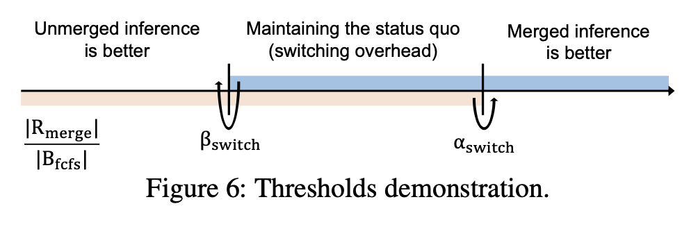
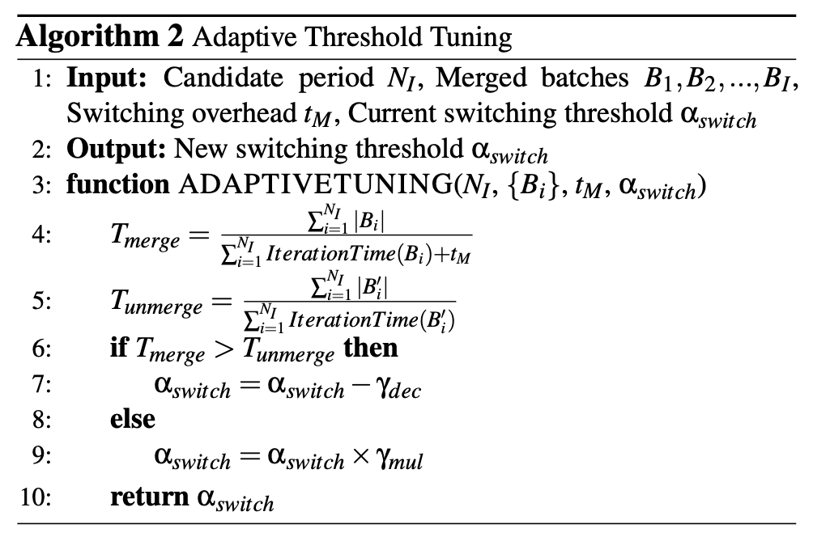
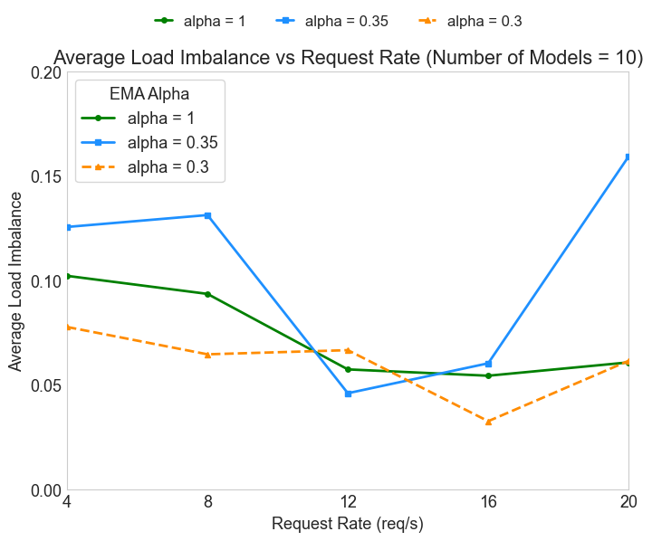

# 1. 负载失衡指标的选取

定义 $engine_i$ 上时刻 $t$ 的负载压力 $P_i(t)$ 为
$$P_i(t) = len(running\_seqs_i) + len(waiting\_seqs_i)$$

其中 $running\_seqs_i$ 和 $waiting\_seqs_i$ 分别表示在 $engine_i$ 上运行和等待的sequence集合。

定义系统在时刻 $t$ 的负载指标 Jain's Fairness Index (JFI) 为
$$JFI(t) = \frac{(\sum_{i=1}^{N} P_i(t))^2}{N \cdot \sum_{i=1}^{N} P_i(t)^2}$$
其中 $N$ 表示系统中engine的数量。

JFI 的取值范围为 $(\frac{1}{N}, 1]$，当所有engine的负载压力相等时，JFI 达到最大值 $1$，表示负载均衡；当负载压力分布极度不均时，JFI 接近 $\frac{1}{N}$，表示负载失衡。

最终用于衡量系统负载失衡程度的指标 $L(t)$ 定义为
$$L(t) = 1 - JFI(t)$$

，$L(t)$ 的取值范围为 $[0, 1 - \frac{1}{N})$，值越大表示负载失衡程度越高。

# 2.改进点 1: 减少决定LoRA模型合并的双阈值 $\beta_{switch}$ 和 $\alpha_{switch}$ 的修正时机

原dLoRA论文中提出的上下阈值修正的发生时机是由估测的合并推理吞吐量 $\hat{T}_{merge}$ 和不合并推理吞吐量 $\hat{T}_{no\_merge}$ 的比较结果决定的：当 $\hat{T}_{merge} > \hat{T}_{no\_merge}$ 时，则认为合并推理更优，此时向 $\alpha_{switch}$ 减去AIMD修正值 $\delta_{lin}$，否则向 $\alpha_{switch}$ 乘上AIMD修正值 $\delta_{mul}$。

然而这种修正时机依赖的吞吐量估测结果可能存在较大的噪声，导致阈值频繁波动，从而影响系统的稳定性。为了解决这个问题，一种经常用于平滑决策过程的方法是采用 Exponential Moving Average (EMA) 来平滑吞吐量估测结果。
具体来说，我们引入一个平滑系数 $\alpha \in [0, 1)$，并定义平滑后的吞吐量估测结果为：
$$\bar{T}_{merge}(t) = (1 - \alpha) \cdot \bar{T}_{merge}(t-1) + \alpha \cdot \hat{T}_{merge}(t)$$

可以看到, 当 $\alpha = 1$ 时，$\bar{T}_{merge}(t)$ 退化为原论文使用的即时估测值 $\hat{T}_{merge}(t)$；当 $\alpha$ 趋近于 $0$ 时，$\bar{T}_{merge}(t)$ 更加平滑，减少了噪声的影响。
具体的 $\alpha$ 选取通过实验调优来确定，以在吞吐量和稳定性之间取得平衡。

# 3.改进点 2: 引入生成Token数量作为FCFS调度的辅助参考指标

在原有的FCFS调度策略中，任务的调度顺序仅依据任务的到达时间。然而，在实际应用中，不同任务可能需要生成不同数量的Tokens，只考虑到达时间可能导致某些需要生成少量Tokens的任务长时间等待而造成饥饿，从而影响整体系统的响应时间和用户体验。
为了解决这个问题，可以引入已生成Token数量取代FCFS调度，定义三个阈值：
- $thresh_{low}$：低阈值，小于该值的任务优先级最高
- $thresh_{mid}$：中阈值，处于该范围内的任务优先级次之
- $thresh_{high}$：高阈值，大于该值的任务优先级最低

引入后，系统的TTFT（Time To First Token）指标得到了改善。